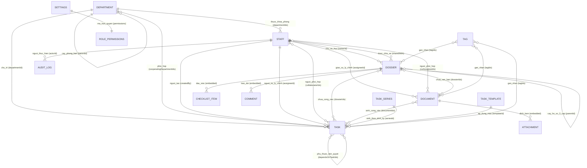

# TÀI LIỆU MÔ TẢ CHI TIẾT CƠ SỞ DỮ LIỆU HỆ THỐNG MY OFFICE
*(Database Schema & Data Architecture Specification)*

---

## MỤC LỤC
1. [TỔNG QUAN KIẾN TRÚC DỮ LIỆU](#1-tổng-quan-kiến-trúc-dữ-liệu)
2. [SƠ ĐỒ QUAN HỆ THỰC THỂ (ERD)](#2-sơ-đồ-quan-hệ-thực-thể-erd)
3. [CHI TIẾT CÁC BẢNG / COLLECTIONS](#3-chi-tiết-các-bảng--collections)
   - [3.1. Collection `documents` (Văn bản)](#31-collection-documents-văn-bản)
   - [3.2. Collection `dossiers` (Hồ sơ công việc)](#32-collection-dossiers-hồ-sơ-công-việc)
   - [3.3. Collection `tasks` (Công việc)](#33-collection-tasks-công-việc)
   - [3.4. Collection `taskSeries` (Chuỗi công việc định kỳ)](#34-collection-taskseries-chuỗi-công-việc-định-kỳ)
   - [3.5. Collection `taskTemplates` (Mẫu quy trình công việc)](#35-collection-tasktemplates-mẫu-quy-trình-công-việc)
   - [3.6. Collection `departments` (Khoa / Phòng ban)](#36-collection-departments-khoa--phòng-ban)
   - [3.7. Collection `staff` (Nhân sự / Cán bộ)](#37-collection-staff-nhân-sự--cán-bộ)
   - [3.8. Collection `tags` (Nhãn phân loại)](#38-collection-tags-nhãn-phân-loại)
   - [3.9. Collection `settings` (Cấu hình hệ thống & Ma trận phân quyền)](#39-collection-settings-cấu-hình-hệ-thống--ma-trận-phân-quyền)
   - [3.10. Collection `auditLogs` (Nhật ký kiểm toán)](#310-collection-auditlogs-nhật-ký-kiểm-toán)
4. [MỐI QUAN HỆ & RÀNG BUỘC TOÀN VẸN DỮ LIỆU (RELATIONSHIPS & CONSTRAINTS)](#4-mối-quan-hệ--ràng-buộc-toàn-vẹn-dữ-liệu-relationships--constraints)
5. [CHỈ MỤC (INDEXES) & CHIẾN LƯỢC TRUY VẤN (QUERY PATTERNS)](#5-chỉ-mục-indexes--chiến-lược-truy-vấn-query-patterns)
6. [SCHEMA LƯU TRỮ CỤC BỘ (CLIENT LOCALSTORAGE CACHE)](#6-schema-lưu-trữ-cục-bộ-client-localstorage-cache)
7. [QUY TẮC BẢO TOÀN DỮ LIỆU & GIAO DỊCH BATCH (BATCH CHUNKING)](#7-quy-tắc-bảo-toàn-dữ-liệu--giao-dịch-batch-batch-chunking)

---

## 1. TỔNG QUAN KIẾN TRÚC DỮ LIỆU

Hệ thống **My Office** sử dụng cơ sở dữ liệu NoSQL đám mây **Google Cloud Firestore**. Kiến trúc dữ liệu được thiết kế theo mô hình lai (Hybrid Document-Relational Pattern):
- **Document-oriented**: Tận dụng tính linh hoạt của NoSQL cho việc nhúng các danh sách con có kích thước hữu hạn (Checklist, Comments, Attachments, Subtasks) trực tiếp vào tài liệu cha để đọc nhanh trong 1 lượt truy vấn (Zero Join Overhead).
- **Referential Integrity**: Sử dụng các mảng khóa ngoại (`dossierIds`, `documentIds`, `tagIds`, `collaboratorIds`, `sharedWith`, `departmentIds`, `dependsOnTaskIds`) để thiết lập các mối quan hệ nhiều - nhiều (N - N) phức tạp với toán tử `array-contains` của Firestore.
- **Audit & Soft Deletes**: Hỗ trợ xóa mềm (`deletedAt`) và ghi vết kiểm toán tự động vào collection `auditLogs`.
- **Chunked Mutations**: Mọi thao tác hàng loạt (Bulk Actions) đều được chia nhỏ tối đa 200 operations/batch nhằm đảm bảo an toàn tuyệt đối, không vượt trần 500 operations của Firestore.

---

## 2. SƠ ĐỒ QUAN HỆ THỰC THỂ (ERD)



---

## 3. CHI TIẾT CÁC BẢNG / COLLECTIONS

### 3.1. Collection `documents` (Văn bản)
- **Path**: `/documents/{documentId}`
- **Mô tả**: Lưu trữ thông tin văn bản chỉ đạo, văn bản đi/đến, file đính kèm, hạn xử lý và phân công cán bộ.

| Tên trường | Kiểu dữ liệu | Bắt buộc | Mô tả chi tiết & Ràng buộc |
|---|---|:---:|---|
| `id` | `string` | Có | Document ID do Firestore tự sinh |
| `title` | `string` | Có | Tiêu đề / Trích yếu văn bản |
| `docNumber` | `string` | Không | Số ký hiệu văn bản (ví dụ: `123/UBND-VP`) |
| `issueDate` | `Timestamp` | Không | Ngày ban hành văn bản |
| `sender` | `string` | Không | Cơ quan ban hành (ví dụ: `Sở Y tế`) |
| `leader` | `string` | Không | Lãnh đạo ký duyệt hoặc phụ trách chỉ đạo |
| `originalLink` | `string` | Có | URL file gốc (Google Drive hoặc đường link web) |
| `driveFileId` | `string` | Không | File ID trên Google Drive sau khi sao lưu |
| `driveViewUrl` | `string` | Không | Link nhúng iframe xem trước (`/preview`) |
| `mimeType` | `string` | Không | Kiểu định dạng file (`application/pdf`, `url`...) |
| `status` | `string` | Có | Trạng thái: `'pending'`, `'in_progress'`, `'completed'`, `'overdue'`, `'uploading'`, `'upload_failed'` |
| `priority` | `string` | Không | Độ khẩn: `'normal'`, `'urgent'`, `'very_urgent'`, `'express'`, `'express_scheduled'` |
| `deadline` | `Timestamp` | Không | Hạn hoàn thành văn bản |
| `completedDate` | `Timestamp` | Không | Ngày thực tế hoàn thành (phải $\ge$ `issueDate`) |
| `task` | `string` | Không | Nhiệm vụ cụ thể được giao |
| `assigneeId` | `string` | Không | ID cán bộ xử lý chính (trỏ đến `staff.id`) |
| `assignee` | `string` | Không | Tên ngắn cán bộ xử lý chính (denormalized) |
| `coAssigneeIds` | `string[]` | Không | Danh sách ID cán bộ phối hợp xử lý (`staff.id`) |
| `dossierIds` | `string[]` | Không | Danh sách ID hồ sơ công việc chứa văn bản (`dossiers.id`) |
| `tagIds` | `string[]` | Không | Danh sách ID nhãn màu phân loại (`tags.id`) |
| `notes` | `string` | Không | Ghi chú nội bộ văn bản |
| `attachments` | `Attachment[]` | Có | Mảng các tệp đính kèm (cấu trúc bên dưới) |
| `createdAt` | `Timestamp` | Có | Thời điểm tiếp nhận |
| `updatedAt` | `Timestamp` | Có | Thời điểm cập nhật lần cuối |

---

### 3.2. Collection `dossiers` (Hồ sơ công việc)
- **Path**: `/dossiers/{dossierId}`
- **Mô tả**: Lưu trữ thông tin hồ sơ công việc, cấu trúc cây phân cấp 3 cấp, checklist và thảo luận.

| Tên trường | Kiểu dữ liệu | Bắt buộc | Mô tả chi tiết & Ràng buộc |
|---|---|:---:|---|
| `id` | `string` | Có | Document ID do Firestore tự sinh |
| `title` | `string` | Có | Tên hồ sơ công việc |
| `description` | `string` | Không | Mô tả mục tiêu, phạm vi và căn cứ pháp lý |
| `notes` | `string` | Không | Ghi chú cá nhân (hỗ trợ autosave) |
| `parentId` | `string \| null`| Có | ID hồ sơ cha (`null` = hồ sơ Cấp 1) |
| `level` | `number` | Có | Cấp độ phân cấp: `1`, `2`, `3` |
| `order` | `number` | Có | Thứ tự sắp xếp hiển thị |
| `ownerId` | `string` | Có | ID cán bộ sở hữu hồ sơ (`staff.id`) |
| `sharedWith` | `string[]` | Có | Danh sách ID cán bộ được chia sẻ quyền xem |
| `status` | `string` | Có | Trạng thái: `'active'`, `'archived'` |
| `tagIds` | `string[]` | Không | Danh sách ID nhãn màu phân loại |
| `checklist` | `ChecklistItem[]`| Có | Mảng các đầu việc tiến độ (cấu trúc bên dưới) |
| `comments` | `DossierComment[]`| Có | Mảng các tin nhắn trao đổi nội bộ |
| `unreadComments` | `Record<string, number>` | Không | Bản đồ đếm tin nhắn chưa đọc của từng cán bộ |
| `createdAt` | `Timestamp` | Có | Thời điểm tạo hồ sơ |
| `updatedAt` | `Timestamp` | Có | Thời điểm cập nhật lần cuối |
| `deletedAt` | `Timestamp \| null`| Không | Thời điểm xóa mềm (nếu có) |

---

### 3.3. Collection `tasks` (Công việc)
- **Path**: `/tasks/{taskId}`
- **Mô tả**: Lưu trữ từng thực thể công việc cụ thể (instance), quản lý tiến độ, phân công chủ trì/phối hợp, trạng thái phụ thuộc và liên kết văn bản/hồ sơ.

| Tên trường | Kiểu dữ liệu | Bắt buộc | Mô tả chi tiết & Ràng buộc |
|---|---|:---:|---|
| `id` | `string` | Có | Document ID do Firestore tự sinh (hoặc `seriesId:YYYY-MM-DD` cho việc định kỳ) |
| `taskCode` | `string \| null` | Không | Mã định danh công việc (ví dụ: `CV-2026-001`) |
| `title` | `string` | Có | Tiêu đề công việc (hiển thị trọn vẹn, xuống dòng tự nhiên) |
| `description` | `string \| null` | Không | Mô tả chi tiết nội dung nhiệm vụ |
| `type` | `string` | Có | Loại công việc: `'single'` (đơn lẻ), `'occurrence'` (lần lặp định kỳ) |
| `status` | `string` | Có | Trạng thái: `'pending'`, `'in_progress'`, `'blocked'`, `'completed'`, `'cancelled'` |
| `priority` | `string` | Có | Mức ưu tiên: `'low'` (Thấp), `'normal'` (Bình thường), `'high'` (Cao), `'urgent'` (Khẩn cấp) |
| `progress` | `number` | Có | Tiến độ hoàn thành: từ `0` đến `100` (%) |
| `progressMode` | `string` | Có | Chế độ tính tiến độ: `'manual'` (nhập tay) hoặc `'subtask'` (tự tính theo việc con) |
| `isClosed` | `boolean` | Có | `true` khi trạng thái là `completed` hoặc `cancelled` (dùng tối ưu truy vấn Quá hạn) |
| `startDate` | `Timestamp \| null` | Không | Ngày bắt đầu triển khai |
| `dueDate` | `Timestamp \| null` | Không | Hạn định hoàn thành công việc |
| `completedAt` | `Timestamp \| null` | Không | Thời điểm thực tế hoàn thành |
| `estimatedMinutes` | `number \| null` | Không | Thời gian ước tính hoàn thành (phút) |
| `occurrenceDate` | `Timestamp \| null` | Không | Ngày lặp (dành riêng cho `type: 'occurrence'`) |
| `visibleFrom` | `Timestamp \| null` | Không | Thời điểm bắt đầu hiển thị lên lịch |
| `createdBy` | `string` | Có | ID cán bộ tạo công việc (`staff.id` hoặc `'admin'`) |
| `assigneeId` | `string \| null` | Không | ID cán bộ xử lý chính (`staff.id`) |
| `assigneeName` | `string \| null` | Không | Tên ngắn của cán bộ xử lý chính (denormalized) |
| `collaboratorIds` | `string[]` | Có | Danh sách ID các cán bộ phối hợp xử lý |
| `followerIds` | `string[]` | Có | Danh sách ID cán bộ theo dõi tiến độ |
| `departmentId` | `string \| null` | Không | ID khoa/phòng ban **Chủ trì** thực hiện (`departments.id`) |
| `cooperatingDepartmentIds` | `string[]` | Có | Danh sách ID các khoa/phòng ban **Phối hợp** |
| `assigneeDepartmentId` | `string \| null` | Không | Snapshot ID phòng ban của người xử lý tại thời điểm giao việc |
| `blockedReason` | `string \| null` | Không | Lý do bị chặn: `'dependency'` (do việc tiên quyết) hoặc `'manual'` (chặn thủ công) |
| `blockedByTaskIds` | `string[]` | Có | Danh sách ID các công việc tiên quyết chưa hoàn thành đang gây chặn |
| `blockedNote` | `string \| null` | Không | Ghi chú lý do bị chặn |
| `previousStatus` | `string \| null` | Không | Trạng thái trước khi bị chặn (để khôi phục khi unblock) |
| `dependsOnTaskIds` | `string[]` | Có | Danh sách ID các công việc tiên quyết (bắt buộc hoàn thành trước) |
| `relatedTaskIds` | `string[]` | Có | Danh sách ID các công việc có liên quan |
| `parentTaskId` | `string \| null` | Không | ID công việc cha nếu đây là công việc con (Subtask) |
| `dossierIds` | `string[]` | Có | Danh sách ID các hồ sơ công việc chứa công việc này |
| `documentIds` | `string[]` | Có | Danh sách ID các văn bản chỉ đạo liên quan |
| `seriesId` | `string \| null` | Không | ID của chuỗi công việc định kỳ (`taskSeries.id`) |
| `occurrenceKey` | `string \| null` | Không | Khóa định danh lần lặp: `"seriesId:YYYY-MM-DD"` |
| `isDetached` | `boolean` | Không | `true` nếu lần lặp này đã được tách riêng ra khỏi chuỗi |
| `templateId` | `string \| null` | Không | ID mẫu quy trình áp dụng (`taskTemplates.id`) |
| `tagIds` | `string[]` | Có | Danh sách ID các nhãn màu |
| `attachments` | `Attachment[]` | Có | Danh sách tệp đính kèm |
| `source` | `string` | Có | Nguồn tạo: `'manual'`, `'recurring'`, `'template'`, `'document'`, `'system'` |
| `createdAt` | `Timestamp` | Có | Thời điểm tạo |
| `updatedAt` | `Timestamp` | Có | Thời điểm cập nhật lần cuối |
| `deletedAt` | `Timestamp \| null` | Không | Thời điểm xóa mềm |

---

### 3.4. Collection `taskSeries` (Chuỗi công việc định kỳ)
- **Path**: `/taskSeries/{seriesId}`
- **Mô tả**: Lưu trữ quy tắc định kỳ (blueprint/rule) để tự động sinh ra các công việc con (`tasks`) lặp lại theo chu kỳ.

| Tên trường | Kiểu dữ liệu | Bắt buộc | Mô tả chi tiết & Ràng buộc |
|---|---|:---:|---|
| `id` | `string` | Có | Document ID do Firestore tự sinh |
| `title` | `string` | Có | Tiêu đề chuỗi công việc định kỳ |
| `description` | `string \| null` | Không | Mô tả công việc |
| `frequency` | `string` | Có | Chu kỳ lặp: `'daily'`, `'weekly'`, `'monthly'`, `'yearly'` |
| `interval` | `number` | Có | Bước lặp (ví dụ: `1` = mỗi tuần, `2` = 2 tuần một lần) |
| `byWeekday` | `number[] \| null` | Không | Danh sách thứ trong tuần (theo chuẩn ISO: `1`=T2 ... `7`=CN) |
| `byMonthDay` | `number[] \| null` | Không | Danh sách ngày trong tháng (`1`-`31`, `-1` = ngày cuối tháng) |
| `anchorDate` | `Timestamp` | Có | Ngày mốc để tính toán bước lặp |
| `timezone` | `string` | Có | Múi giờ tính toán (Mặc định: `"Asia/Ho_Chi_Minh"`) |
| `weekendPolicy` | `string` | Không | Xử lý ngày nghỉ: `'exact'`, `'shift_friday'`, `'shift_monday'` |
| `dueOffsetMinutes` | `number` | Có | Khoảng thời gian từ lúc phát sinh đến hạn deadline (phút) |
| `leadDays` | `number` | Có | Số ngày nhìn thấy trước trên lịch làm việc |
| `status` | `string` | Có | Trạng thái chuỗi: `'active'`, `'paused'`, `'ended'` |
| `startDate` | `Timestamp` | Có | Ngày bắt đầu áp dụng chuỗi |
| `endDate` | `Timestamp \| null` | Không | Ngày kết thúc chuỗi (`null` = lặp vô hạn) |
| `departmentId` | `string \| null` | Không | Khoa/phòng ban chủ trì |
| `assigneeId` | `string \| null` | Không | Cán bộ xử lý mặc định |
| `collaboratorIds` | `string[]` | Có | Cán bộ phối hợp mặc định |
| `priority` | `string` | Có | Mức ưu tiên mặc định |
| `estimatedMinutes` | `number \| null` | Không | Thời gian ước tính |
| `dossierIds` | `string[]` | Có | Hồ sơ mặc định gắn vào |
| `subtasks` | `SubtaskTemplate[]`| Có | Mảng các công việc con mặc định tự sinh theo |
| `lastGeneratedAt` | `Timestamp \| null` | Không | Thời điểm sinh công việc gần nhất |
| `createdAt` | `Timestamp` | Có | Thời điểm tạo chuỗi |
| `updatedAt` | `Timestamp` | Có | Thời điểm cập nhật lần cuối |

---

### 3.5. Collection `taskTemplates` (Mẫu quy trình công việc)
- **Path**: `/taskTemplates/{templateId}`
- **Mô tả**: Lưu trữ các mẫu quy trình chuẩn hóa (SOPs, bảng kiểm phẫu thuật WHO, báo cáo sự cố...).

| Tên trường | Kiểu dữ liệu | Bắt buộc | Mô tả chi tiết |
|---|---|:---:|---|
| `id` | `string` | Có | Document ID do Firestore tự sinh |
| `title` | `string` | Có | Tên mẫu quy trình |
| `description` | `string \| null` | Không | Hướng dẫn thực hiện mẫu quy trình |
| `category` | `string` | Có | Phân loại: `'medical'`, `'administrative'`, `'quality'`, `'general'` |
| `defaultPriority` | `string` | Có | Mức ưu tiên mặc định: `'low'`, `'normal'`, `'high'`, `'urgent'` |
| `defaultEstimatedMinutes`| `number \| null` | Không | Thời gian ước tính tiêu chuẩn |
| `subtasks` | `SubtaskTemplate[]` | Có | Danh sách các đầu việc con tiêu chuẩn |
| `departmentId` | `string \| null` | Không | Khoa phòng ban hành mẫu (`null` = áp dụng toàn viện) |
| `isActive` | `boolean` | Có | Trạng thái kích hoạt sử dụng |
| `createdAt` | `Timestamp` | Có | Thời điểm tạo mẫu |

---

### 3.6. Collection `departments` (Khoa / Phòng ban)
- **Path**: `/departments/{departmentId}`
- **Mô tả**: Lưu trữ cơ cấu tổ chức phân cấp khoa/phòng ban của cơ quan/bệnh viện.

| Tên trường | Kiểu dữ liệu | Bắt buộc | Mô tả chi tiết & Ràng buộc |
|---|---|:---:|---|
| `id` | `string` | Có | Mã phòng ban / Document ID (ví dụ: `khoa-kham-benh`) |
| `name` | `string` | Có | Tên đầy đủ (ví dụ: *Khoa Khám bệnh*) |
| `shortName` | `string` | Có | Tên viết tắt hiển thị trên badge (ví dụ: *KKB*) |
| `code` | `string` | Có | Mã ký hiệu nghiệp vụ (ví dụ: `KB`) |
| `type` | `string` | Có | Phân loại: `'clinical'`, `'paraclinical'`, `'administrative'`, `'management'` |
| `parentId` | `string \| null` | Có | ID phòng ban cấp trên (`null` = cấp cao nhất) |
| `headStaffId` | `string \| null` | Không | ID Trưởng khoa / Trưởng phòng (`staff.id`) |
| `deputyStaffIds` | `string[]` | Có | Danh sách ID các Phó khoa / Phó phòng |
| `order` | `number` | Có | Thứ tự sắp xếp trong cây sơ đồ |
| `isActive` | `boolean` | Có | Trạng thái hoạt động |
| `createdAt` | `Timestamp` | Có | Thời điểm tạo |
| `updatedAt` | `Timestamp` | Có | Thời điểm cập nhật |

---

### 3.7. Collection `staff` (Nhân sự / Cán bộ)
- **Path**: `/staff/{staffId}`
- **Mô tả**: Danh bạ cán bộ, nhân viên, gán vai trò RBAC và khoa phòng công tác.

| Tên trường | Kiểu dữ liệu | Bắt buộc | Mô tả chi tiết |
|---|---|:---:|---|
| `id` | `string` | Có | Document ID do Firestore tự sinh |
| `name` | `string` | Có | Họ và tên đầy đủ (ví dụ: *Bùi Minh Khôi*) |
| `shortName` | `string` | Có | Tên ngắn hiển thị trên bảng (ví dụ: *Khôi*) |
| `username` | `string` | Có | Tên đăng nhập (duy nhất) |
| `passwordHash` | `string` | Không | Mật khẩu băm chuẩn SHA-256 |
| `title` | `string` | Không | Chức danh chuyên môn (ví dụ: *Bác sĩ Chuyên khoa 2*) |
| `position` | `string` | Không | Chức vụ quản lý (ví dụ: *Trưởng khoa*) |
| `role` | `string` | Có | Vai trò RBAC: `'admin'`, `'truong_phong'`, `'pho_phong'`, `'nhan_vien'`, `'giao_viec'`, `'guest'` |
| `primaryDepartmentId` | `string \| null` | Không | ID khoa/phòng ban công tác chính |
| `departmentIds` | `string[]` | Có | Danh sách ID các khoa/phòng công tác kiêm nhiệm |
| `isActive` | `boolean` | Có | Trạng thái công tác (`true` = Đang làm việc) |
| `order` | `number` | Có | Thứ tự ưu tiên hiển thị |
| `createdAt` | `Timestamp` | Có | Thời điểm tạo |
| `updatedAt` | `Timestamp` | Có | Thời điểm cập nhật |

---

### 3.8. Collection `tags` (Nhãn phân loại)
- **Path**: `/tags/{tagId}`
- **Mô tả**: Danh mục thẻ nhãn màu phân loại văn bản, hồ sơ và công việc.

| Tên trường | Kiểu dữ liệu | Bắt buộc | Mô tả chi tiết |
|---|---|:---:|---|
| `id` | `string` | Có | Document ID do Firestore tự sinh |
| `name` | `string` | Có | Tên nhãn (ví dụ: *Khẩn*, *BHYT*, *Dự án CNTT*) |
| `color` | `string` | Có | Mã màu Tailwind hoặc Hex (ví dụ: `'red'`, `'blue'`, `'emerald'`) |
| `createdAt` | `Timestamp` | Có | Thời điểm tạo nhãn |

---

### 3.9. Collection `settings` (Cấu hình hệ thống & Ma trận phân quyền)
- **Path**: `/settings/{settingKey}`
- **Mô tả**: Lưu trữ các cấu hình chung của hệ thống.
  - Document `/settings/rolePermissions`: Lưu trữ ma trận phân quyền chi tiết cho từng vai trò.
  - Document `/settings/system`: Cấu hình tên cơ quan, Google Drive backup folder ID...

#### Cấu trúc Ma trận Quyền (`PermissionMatrix` trong `/settings/rolePermissions`):
```typescript
{
  admin: {
    "document:view_all": true, "document:create": true, "document:edit": true, "document:delete": true, "document:assign": true,
    "task:view_all": true, "task:create": true, "task:edit_own": true, "task:edit_all": true, "task:delete_own": true, "task:delete_all": true, "task:assign": true, "task:change_status": true,
    "dossier:create": true, "dossier:edit_own": true, "dossier:edit_all": true, "dossier:delete_own": true, "dossier:delete_all": true, "dossier:transfer": true, "dossier:share": true,
    "org:manage_departments": true, "org:manage_staff": true, "org:manage_roles": true,
    "settings:access": true, "settings:manage_tags": true, "settings:manage_permissions": true
  },
  truong_phong: {
    "document:view_department": true, "document:create": true, "document:edit": true, "document:assign": true,
    "task:view_department": true, "task:create": true, "task:edit_own": true, "task:edit_all": true, "task:delete_own": true, "task:delete_all": true, "task:assign": true, "task:change_status": true,
    "dossier:create": true, "dossier:edit_own": true, "dossier:edit_all": true, "dossier:delete_own": true, "dossier:delete_all": true, "dossier:transfer": true, "dossier:share": true
  },
  pho_phong: {
    "document:view_department": true, "document:create": true, "document:edit": true, "document:assign": true,
    "task:view_department": true, "task:create": true, "task:edit_own": true, "task:edit_all": true, "task:delete_own": true, "task:assign": true,
    "dossier:create": true, "dossier:edit_own": true, "dossier:edit_all": true, "dossier:delete_own": true, "dossier:share": true
  },
  nhan_vien: {
    "document:view_assigned": true, "document:create": true,
    "task:view_assigned": true, "task:create": true, "task:edit_own": true, "task:delete_own": true, "task:complete_assigned": true,
    "dossier:create": true, "dossier:edit_own": true, "dossier:delete_own": true, "dossier:share": true
  },
  giao_viec: {
    "document:view_all": true, "document:create": true, "document:edit": true, "document:assign": true,
    "task:view_all": true, "task:create": true, "task:assign": true
  },
  guest: {
    "document:view_assigned": true
  }
}
```

---

### 3.10. Collection `auditLogs` (Nhật ký kiểm toán)
- **Path**: `/auditLogs/{logId}`
- **Mô tả**: Lưu vết lịch sử toàn bộ các hành động thêm, sửa, xóa, chuyển giao trên hệ thống.

| Tên trường | Kiểu dữ liệu | Bắt buộc | Mô tả chi tiết |
|---|---|:---:|---|
| `id` | `string` | Có | Document ID do Firestore tự sinh |
| `action` | `string` | Có | Hành động: `'CREATE'`, `'UPDATE'`, `'DELETE'`, `'TRANSFER'`, `'STATUS_CHANGED'`, `'ASSIGNED'` |
| `targetType` | `string` | Có | Loại đối tượng: `'document'`, `'dossier'`, `'task'`, `'tag'`, `'staff'`, `'department'` |
| `targetId` | `string` | Có | ID của đối tượng bị tác động |
| `actorId` | `string` | Có | ID của người thực hiện (`staff.id` hoặc `'admin'`) |
| `actorName` | `string` | Không | Tên hiển thị của người thực hiện |
| `metadata` | `Record<string, any>`| Có | Thông tin chi tiết trước/sau thay đổi hoặc lý do |
| `timestamp` | `Timestamp` | Có | Thời điểm phát sinh hành động |

---

## 4. MỐI QUAN HỆ & RÀNG BUỘC TOÀN VẸN DỮ LIỆU (RELATIONSHIPS & CONSTRAINTS)

### 4.1. Ràng buộc Sở hữu & Giới hạn Phạm vi Khoa phòng
1. **Phân tách quyền Sửa/Xóa của mình (`own`) vs trong khoa (`all`)**:
   - `task:edit_own` và `task:delete_own`: Chỉ được phép tác động lên công việc khi `task.createdBy === currentStaffId`.
   - `dossier:edit_own` và `dossier:delete_own`: Chỉ được phép tác động lên hồ sơ khi `dossier.ownerId === currentStaffId`.
2. **Quy tắc Phạm vi Khoa phòng (Department Scope)**:
   - Các quyền `task:edit_all`, `task:delete_all`, `dossier:edit_all`, `dossier:delete_all` khi cấp cho người dùng không phải Admin (`role !== 'admin'`) **chỉ được phép thực thi nếu đối tượng đó thuộc cùng khoa phòng với người dùng**:
     $$\text{task.departmentId} \in \text{user.departmentIds} \quad \lor \quad \text{task.cooperatingDepartmentIds} \cap \text{user.departmentIds} \neq \emptyset$$
   - Đối với Hồ sơ (`dossier`), tra cứu khoa phòng của chủ sở hữu hồ sơ (`dossier.ownerId`):
     $$\text{owner.departmentIds} \cap \text{user.departmentIds} \neq \emptyset$$
   - Người dùng Admin có toàn quyền vượt qua kiểm tra phạm vi khoa phòng.

### 4.2. Ràng buộc An toàn khi Xóa Hồ sơ
- **Chặn xóa khi đang chia sẻ**: Tuyệt đối không cho phép xóa hồ sơ nếu mảng `dossier.sharedWith` có ít nhất 1 thành viên (`sharedWith.length > 0`), nhằm bảo vệ quyền lợi làm việc của các thành viên được chia sẻ.

### 4.3. Ràng buộc Chống vòng lặp Phụ thuộc Công việc (No Dependency Cycles)
- Khi một công việc A thiết lập phụ thuộc vào công việc B (`A.dependsOnTaskIds.includes(B.id)`), thuật toán đồ thị có hướng (DAG) sẽ kiểm tra đệ quy để đảm bảo B không phụ thuộc trực tiếp hoặc gián tiếp vào A, ngăn chặn deadlock tiến độ.

---

## 5. CHỈ MỤC (INDEXES) & CHIẾN LƯỢC TRUY VẤN (QUERY PATTERNS)

### 5.1. Các Composite Indexes chính trên Firestore:

1. **Truy vấn công việc quá hạn (`tasks`)**:
   - `isClosed` ASC, `dueDate` ASC
   - Cho phép tìm kiếm nhanh: `where("isClosed", "==", false).where("dueDate", "<", now)` mà không cần quét toàn bộ bảng.
2. **Truy vấn công việc theo phòng ban & thời gian (`tasks`)**:
   - `departmentId` ASC, `createdAt` DESC
3. **Truy vấn công việc theo người xử lý & trạng thái (`tasks`)**:
   - `assigneeId` ASC, `status` ASC, `dueDate` ASC
4. **Truy vấn hồ sơ theo cây phân cấp & người sở hữu (`dossiers`)**:
   - `parentId` ASC, `ownerId` ASC, `order` ASC
5. **Truy vấn văn bản theo người xử lý & trạng thái (`documents`)**:
   - `assigneeId` ASC, `status` ASC, `issueDate` DESC

---

## 6. SCHEMA LƯU TRỮ CỤC BỘ (CLIENT LOCALSTORAGE CACHE)

Để tối ưu hóa trải nghiệm người dùng và giảm chi phí truy vấn Firestore, hệ thống sử dụng `localStorage` lưu trữ các trạng thái giao diện:

| Key | Kiểu | Mô tả |
|---|---|---|
| `myoffice_task_view_mode` | `'list' \| 'kanban' \| 'calendar'` | Chế độ xem công việc được chọn gần nhất |
| `myoffice_dossier_expanded_ids`| `string[]` (JSON) | Danh sách các ID nhánh hồ sơ đang mở rộng |
| `myoffice_dossier_nav_all_expanded`| `'true' \| 'false'` | Trạng thái mở rộng toàn bộ của cây hồ sơ |
| `myoffice_staff_identity` | `{ staffId, staffName, role }` | Thông tin định danh cán bộ hiện tại đang làm việc |
| `myoffice_dossier_read_timestamps`| `Record<string, number>` | Thời điểm đọc tin nhắn gần nhất của từng hồ sơ |

---

## 7. QUY TẮC BẢO TOÀN DỮ LIỆU & GIAO DỊCH BATCH (BATCH CHUNKING)

- **Firestore Batch Limit**: Giới hạn tối đa của Google Firestore là 500 operations/batch.
- **My Office Safety Threshold**: Toàn bộ các hàm cập nhật và xóa hàng loạt (`bulkUpdateTasks`, `bulkDeleteTasks`, `batchAddDossier`) đều chia nhỏ mảng ID thành các chunk có kích thước **tối đa 200 items/batch**. Mỗi item thường đi kèm 1 bản ghi `auditLog`, do đó tổng số operations luôn $\le 400$, an toàn tuyệt đối dưới ngưỡng 500.

---
*Tài liệu được cập nhật ngày 13/09/2026 bởi Đội ngũ Phát triển Hệ thống My Office.*
