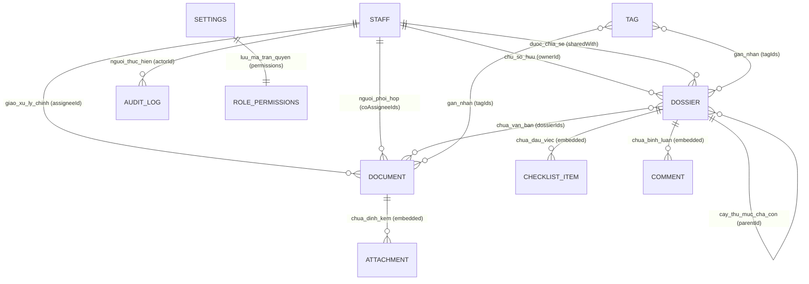

# TÀI LIỆU MÔ TẢ CHI TIẾT CƠ SỞ DỮ LIỆU HỆ THỐNG MY OFFICE
*(Database Schema & Data Architecture Specification)*

---

## MỤC LỤC
1. [TỔNG QUAN KIẾN TRÚC DỮ LIỆU](#1-tổng-quan-kiến-trúc-dữ-liệu)
2. [SƠ ĐỒ QUAN HỆ THỰC THỂ (ERD)](#2-sơ-đồ-quan-hệ-thực-thể-erd)
3. [CHI TIẾT CÁC BẢNG / COLLECTIONS](#3-chi-tiết-các-bảng--collections)
   - [3.1. Collection `documents` (Văn bản)](#31-collection-documents-văn-bản)
   - [3.2. Collection `dossiers` (Hồ sơ công việc)](#32-collection-dossiers-hồ-sơ-công-việc)
   - [3.3. Collection `staff` (Nhân sự / Cán bộ)](#33-collection-staff-nhân-sự--cán-bộ)
   - [3.4. Collection `tags` (Nhãn phân loại)](#34-collection-tags-nhãn-phân-loại)
   - [3.5. Collection `settings` (Cấu hình hệ thống & Phân quyền)](#35-collection-settings-cấu-hình-hệ-thống--phân-quyền)
   - [3.6. Collection `auditLogs` (Nhật ký kiểm toán)](#36-collection-auditlogs-nhật-ký-kiểm-toán)
4. [MỐI QUAN HỆ & RÀNG BUỘC DỮ LIỆU (RELATIONSHIPS & CONSTRAINTS)](#4-mối-quan-hệ--ràng-buộc-dữ-liệu-relationships--constraints)
5. [CHỈ MỤC (INDEXES) & CHIẾN LƯỢC TRUY VẤN (QUERY PATTERNS)](#5-chỉ-mục-indexes--chiến-lược-truy-vấn-query-patterns)
6. [SCHEMA LƯU TRỮ CỤC BỘ (CLIENT LOCALSTORAGE CACHE)](#6-schema-lưu-trữ-cục-bộ-client-localstorage-cache)
7. [QUY TẮC BẢO TOÀN DỮ LIỆU & GIAO DỊCH BATCH](#7-quy-tắc-bảo-toàn-dữ-liệu--giao-dịch-batch)

---

## 1. TỔNG QUAN KIẾN TRÚC DỮ LIỆU

Hệ thống **My Office** sử dụng cơ sở dữ liệu NoSQL đám mây **Google Cloud Firestore**. Kiến trúc dữ liệu được thiết kế theo mô hình lai (Hybrid Document-Relational Pattern):
- **Document-oriented**: Tận dụng tính linh hoạt của NoSQL cho việc nhúng các danh sách con có kích thước hữu hạn (Checklist, Comments, Attachments) trực tiếp vào tài liệu cha để đọc nhanh trong 1 lượt truy vấn (Zero Join Overhead).
- **Referential Integrity**: Sử dụng các mảng khóa ngoại (`dossierIds`, `tagIds`, `coAssigneeIds`, `sharedWith`) để thiết lập các mối quan hệ nhiều - nhiều (N - N) phức tạp với toán tử `array-contains` của Firestore.
- **Audit & Soft Deletes**: Hỗ trợ xóa mềm (`deletedAt`) và ghi vết kiểm toán tự động thông qua Firestore `WriteBatch`.

---

## 2. SƠ ĐỒ QUAN HỆ THỰC THỂ (ERD)



---

## 3. CHI TIẾT CÁC BẢNG / COLLECTIONS

### 3.1. Collection `documents` (Văn bản)
- **Path**: `/documents/{documentId}`
- **Mô tả**: Lưu trữ toàn bộ thông tin về văn bản đi/đến, văn bản chỉ đạo, file quét, hạn xử lý và phân công cán bộ.

| Tên trường | Kiểu dữ liệu | Bắt buộc | Mô tả chi tiết & Ràng buộc |
|---|---|:---:|---|
| `id` | `string` | Có | Document ID do Firestore tự sinh (hoặc cấp phát) |
| `title` | `string` | Có | Tiêu đề / Trích yếu văn bản |
| `docNumber` | `string` | Không | Số ký hiệu văn bản (ví dụ: `123/UBND-VP`) |
| `issueDate` | `Timestamp` | Không | Ngày ban hành văn bản |
| `sender` | `string` | Không | Cơ quan / Đơn vị ban hành (ví dụ: `Sở Y tế`) |
| `leader` | `string` | Không | Lãnh đạo ký duyệt hoặc phụ trách chỉ đạo |
| `originalLink` | `string` | Có | Đường dẫn URL gốc của văn bản (Google Drive hoặc link web) |
| `driveFileId` | `string` | Không | ID file trên Google Drive sau khi đã được sao lưu |
| `driveViewUrl` | `string` | Không | Link xem trước dạng nhúng (`https://drive.google.com/file/d/.../preview`) |
| `mimeType` | `string` | Không | Kiểu định dạng file (`application/pdf`, `url`...) |
| `status` | `string` | Có | Trạng thái xử lý: `'pending'`, `'in_progress'`, `'completed'`, `'overdue'`, `'uploading'`, `'upload_failed'` |
| `priority` | `string` | Không | Độ khẩn: `'normal'`, `'urgent'`, `'very_urgent'`, `'express'`, `'express_scheduled'` (Mặc định: `'normal'`) |
| `deadline` | `Timestamp` | Không | Hạn định hoàn thành văn bản |
| `completedDate` | `Timestamp` | Không | Ngày thực tế hoàn thành văn bản (phải $\ge$ `issueDate`) |
| `task` | `string` | Không | Nhiệm vụ cụ thể được giao xử lý |
| `assigneeId` | `string` | Không | ID cán bộ được giao xử lý chính (khóa ngoại trỏ đến `staff.id`) |
| `assignee` | `string` | Không | Tên ngắn của cán bộ xử lý chính (lưu denormalized để render nhanh) |
| `coAssigneeIds` | `string[]` | Không | Danh sách ID cán bộ phối hợp xử lý (mảng các `staff.id`) |
| `coAssignees` | `string[]` | Không | Danh sách tên ngắn cán bộ phối hợp (legacy denormalized) |
| `dossierIds` | `string[]` | Không | Danh sách ID các hồ sơ công việc chứa văn bản này (khóa ngoại trỏ đến `dossiers.id`) |
| `tagIds` | `string[]` | Không | Danh sách ID các nhãn màu phân loại (khóa ngoại trỏ đến `tags.id`) |
| `tags` | `string[]` | Không | Mảng tên nhãn (legacy tags dạng chuỗi) |
| `notes` | `string` | Không | Ghi chú nội bộ dành riêng cho văn bản |
| `textSnippet` | `string` | Không | Đoạn văn bản trích dẫn nhanh |
| `attachments` | `Attachment[]` | Có | Mảng các tệp đính kèm đi cùng văn bản (cấu trúc chi tiết bên dưới) |
| `createdAt` | `Timestamp` | Có | Thời điểm tiếp nhận văn bản vào hệ thống |
| `updatedAt` | `Timestamp` | Có | Thời điểm cập nhật thông tin văn bản lần cuối |

#### Cấu trúc Object con `Attachment` (trong mảng `attachments`):
```typescript
{
  id: string              // UUID v4 định danh tệp đính kèm
  title: string           // Tên tệp đính kèm (ví dụ: Phụ lục 1)
  originalLink: string    // Đường link gốc tải lên
  driveFileId: string     // File ID sau khi copy lên Google Drive
  driveViewUrl: string    // URL xem trước nhúng iframe
  mimeType: string        // Kiểu mime của tệp
  uploadedAt: Timestamp   // Thời gian đính kèm
}
```

#### Mẫu JSON Document thực tế:
```json
{
  "id": "vFi2ZLQhxrDgpx4TwEOr",
  "title": "V/v điều chỉnh Cổng tiếp nhận dữ liệu Hệ thống thông tin giám định BHYT",
  "docNumber": "9932/SYT-NVY",
  "issueDate": "2026-09-08T00:00:00Z",
  "sender": "Sở Y tế",
  "leader": "Nguyễn Văn A",
  "originalLink": "https://drive.google.com/file/d/1A2B3C.../view",
  "driveViewUrl": "https://drive.google.com/file/d/1A2B3C.../preview",
  "status": "in_progress",
  "priority": "urgent",
  "deadline": "2026-09-15T00:00:00Z",
  "assigneeId": "staff_01",
  "assignee": "Giang",
  "coAssigneeIds": ["staff_02", "staff_03"],
  "dossierIds": ["dossier_bhyt_2026"],
  "tagIds": ["tag_bhyt"],
  "attachments": [
    {
      "id": "att-1",
      "title": "Phụ lục kỹ thuật cổng kết nối",
      "originalLink": "https://drive.google.com/file/d/2X3Y4Z.../view",
      "driveViewUrl": "https://drive.google.com/file/d/2X3Y4Z.../preview",
      "mimeType": "application/pdf"
    }
  ],
  "createdAt": "2026-09-08T08:30:00Z",
  "updatedAt": "2026-09-10T14:40:00Z"
}
```

---

### 3.2. Collection `dossiers` (Hồ sơ công việc)
- **Path**: `/dossiers/{dossierId}`
- **Mô tả**: Quản lý cây hồ sơ công việc phân cấp 3 cấp, tiến độ checklist, không gian trao đổi và cơ chế chia sẻ/bàn giao.

| Tên trường | Kiểu dữ liệu | Bắt buộc | Mô tả chi tiết & Ràng buộc |
|---|---|:---:|---|
| `id` | `string` | Có | ID hồ sơ tự sinh |
| `name` | `string` | Có | Tên thư mục / hồ sơ công việc |
| `parentId` | `string \| null` | Có | ID hồ sơ cha. Nếu là cấp 1 thì giá trị là `null` |
| `level` | `number` | Có | Cấp bậc hồ sơ trong cây thư mục: `1`, `2`, hoặc `3` |
| `order` | `number` | Không | Thứ tự sắp xếp hiển thị giữa các hồ sơ cùng cấp |
| `createdBy` | `string` | Có | ID cán bộ tạo hồ sơ ban đầu |
| `ownerId` | `string` | Có | ID cán bộ đang sở hữu hồ sơ (có quyền xóa, sửa, bàn giao) |
| `description` | `string` | Không | Mô tả căn cứ, mục tiêu của hồ sơ |
| `notes` | `string` | Không | Sổ tay ghi chú cá nhân (tự động lưu autosave) |
| `sharedWith` | `string[]` | Không | Mảng danh sách ID các cán bộ được chia sẻ quyền xem/cộng tác |
| `tagIds` | `string[]` | Không | Mảng ID các nhãn phân loại gắn với hồ sơ |
| `color` | `string` | Không | Màu biểu tượng thư mục (tùy chọn cá nhân hóa) |
| `isArchived` | `boolean` | Không | Trạng thái lưu trữ (`true`: đã hoàn thành và đưa vào kho lưu) |
| `checklist` | `DossierChecklistItem[]` | Có | Danh sách các đầu việc cần làm (mặc định mảng rỗng `[]`) |
| `comments` | `DossierComment[]` | Không | Luồng tin nhắn trao đổi, thảo luận nội bộ |
| `deletedAt` | `Timestamp \| null` | Không | Thời điểm xóa mềm (`null` nếu đang hoạt động) |
| `deletedBy` | `string` | Không | ID người thực hiện xóa mềm hồ sơ |
| `createdAt` | `Timestamp` | Có | Thời điểm khởi tạo hồ sơ |
| `updatedAt` | `Timestamp` | Có | Thời điểm chỉnh sửa hồ sơ gần nhất |

#### Cấu trúc Object con `DossierChecklistItem`:
```typescript
{
  id: string              // UUID v4 của đầu việc
  title: string           // Tiêu đề việc cần làm
  completed: boolean      // Đã xong hay chưa (true/false)
  completedAt?: Timestamp // Thời điểm hoàn thành
  completedBy?: string    // ID cán bộ tích hoàn thành
  order: number           // Thứ tự sắp xếp hiển thị (từ 0 trở lên)
}
```

#### Cấu trúc Object con `DossierComment`:
```typescript
{
  id: string              // UUID v4 của tin nhắn
  senderId: string        // ID cán bộ gửi tin (khóa ngoại trỏ staff.id)
  senderName: string      // Tên hiển thị người gửi (để render nhanh)
  content: string         // Nội dung tin nhắn trao đổi
  createdAt: Timestamp    // Thời điểm gửi tin
}
```

#### Mẫu JSON Document thực tế:
```json
{
  "id": "dossier_bhyt_2026",
  "name": "Đề án Triển khai Cổng giám định BHYT 2026",
  "parentId": null,
  "level": 1,
  "order": 1,
  "createdBy": "staff_01",
  "ownerId": "staff_01",
  "description": "Căn cứ Quyết định số 123/QĐ-SYT về việc nâng cấp hệ thống kết nối BHYT",
  "notes": "Họp rà soát kỹ thuật vào thứ 6 hàng tuần lúc 14h00.",
  "sharedWith": ["staff_02", "staff_04"],
  "tagIds": ["tag_bhyt", "tag_cntt"],
  "isArchived": false,
  "checklist": [
    {
      "id": "task-01",
      "title": "Khảo sát hạ tầng mạng tại các bệnh viện",
      "completed": true,
      "completedAt": "2026-09-09T10:00:00Z",
      "completedBy": "staff_02",
      "order": 0
    },
    {
      "id": "task-02",
      "title": "Kiểm thử API tiếp nhận dữ liệu với BHXH",
      "completed": false,
      "order": 1
    }
  ],
  "comments": [
    {
      "id": "cmt-01",
      "senderId": "staff_02",
      "senderName": "Đức",
      "content": "Đã hoàn thành khảo sát 15 bệnh viện tuyến huyện, báo cáo đính kèm bên dưới.",
      "createdAt": "2026-09-09T10:05:00Z"
    }
  ],
  "createdAt": "2026-09-01T08:00:00Z",
  "updatedAt": "2026-09-10T14:30:00Z"
}
```

---

### 3.3. Collection `staff` (Nhân sự / Cán bộ)
- **Path**: `/staff/{staffId}`
- **Mô tả**: Quản lý thông tin tài khoản, danh tính, chức vụ và trạng thái của cán bộ công chức trong đơn vị.

| Tên trường | Kiểu dữ liệu | Bắt buộc | Mô tả chi tiết & Ràng buộc |
|---|---|:---:|---|
| `id` | `string` | Có | ID định danh nhân sự (8 ký tự nanoid hoặc tự sinh) |
| `fullName` | `string` | Có | Họ và tên đầy đủ (ví dụ: `Nguyễn Văn Giang`) |
| `shortName` | `string` | Có | Tên ngắn hiển thị trên bảng và badge (ví dụ: `Giang`) |
| `nickname` | `string` | Có | Tên đăng nhập (duy nhất, viết thường không dấu) |
| `passwordHash` | `string` | Có | Chuỗi băm mật khẩu chuẩn SHA-256 |
| `title` | `string` | Không | Chức danh chuyên môn (ví dụ: `Chuyên viên`, `Kế toán viên`) |
| `position` | `string` | Không | Chức vụ quản lý (ví dụ: `Trưởng phòng`, `Phó Giám đốc`) |
| `isActive` | `boolean` | Có | Trạng thái công tác (`true`: đang làm việc, `false`: tạm khóa/nghỉ) |
| `createdAt` | `Timestamp` | Có | Thời điểm tạo hồ sơ cán bộ |
| `updatedAt` | `Timestamp` | Có | Thời điểm cập nhật thông tin cán bộ |

---

### 3.4. Collection `tags` (Nhãn phân loại)
- **Path**: `/tags/{tagId}`
- **Mô tả**: Bảng danh mục nhãn màu dùng để gắn nhãn, nhóm và phân loại văn bản/hồ sơ theo nghiệp vụ.

| Tên trường | Kiểu dữ liệu | Bắt buộc | Mô tả chi tiết & Ràng buộc |
|---|---|:---:|---|
| `id` | `string` | Có | ID định danh nhãn |
| `name` | `string` | Có | Tên hiển thị của nhãn (ví dụ: `BHYT`, `Tổ chức cán bộ`) |
| `color` | `string` | Có | Mã màu HEX hiển thị badge (ví dụ: `#3b82f6`, `#ef4444`) |
| `createdBy` | `string` | Có | ID cán bộ tạo nhãn |
| `deletedAt` | `Timestamp \| null` | Không | Thời điểm xóa mềm (`null` nếu đang hoạt động) |
| `deletedBy` | `string` | Không | ID cán bộ thực hiện xóa nhãn |
| `createdAt` | `Timestamp` | Có | Thời điểm tạo nhãn |

---

### 3.5. Collection `settings` (Cấu hình hệ thống & Phân quyền)
- **Path**: `/settings/{settingId}`
- **Document tiêu chuẩn**: `/settings/permissions`
- **Mô tả**: Lưu trữ ma trận cấu hình phân quyền theo vai trò người dùng (RBAC).

#### Cấu trúc Document `permissions`:
```typescript
{
  admin: {
    canViewAll: true,
    canAddDocument: true,
    canEditDocument: true,
    canDeleteDocument: true,
    canAssignStaff: true,
    canSetDeadline: true,
    canSetCompletedDate: true,
    canEditNotes: true,
    canToggleComplete: true,
    canCompleteAssigned: true,
    canCopyTaskString: true,
    canAccessSettings: true,
    canCreateDossier: true,
    canEditDossier: true,
    canDeleteDossier: true,
    canTransferDossier: true
  },
  staff: {
    canViewAll: true,
    canAddDocument: true,
    canEditDocument: true,
    canDeleteDocument: false,
    canAssignStaff: true,
    canSetDeadline: true,
    canSetCompletedDate: true,
    canEditNotes: true,
    canToggleComplete: false,
    canCompleteAssigned: true,
    canCopyTaskString: true,
    canAccessSettings: false,
    canCreateDossier: true,
    canEditDossier: true,
    canDeleteDossier: true,
    canTransferDossier: true
  },
  guest: {
    canViewAll: true,
    canAddDocument: false,
    canEditDocument: false,
    canDeleteDocument: false,
    canAssignStaff: false,
    canSetDeadline: false,
    canSetCompletedDate: false,
    canEditNotes: false,
    canToggleComplete: false,
    canCompleteAssigned: false,
    canCopyTaskString: true,
    canAccessSettings: false,
    canCreateDossier: false,
    canEditDossier: false,
    canDeleteDossier: false,
    canTransferDossier: false
  }
}
```

---

### 3.6. Collection `auditLogs` (Nhật ký kiểm toán)
- **Path**: `/auditLogs/{auditLogId}`
- **Mô tả**: Lưu vết toàn bộ lịch sử biến động quan trọng của hệ thống (Tạo, Sửa, Xóa, Bàn giao).

| Tên trường | Kiểu dữ liệu | Bắt buộc | Mô tả chi tiết |
|---|---|:---:|---|
| `id` | `string` | Có | ID bản ghi kiểm toán |
| `entityType` | `string` | Có | Loại đối tượng: `'dossier'`, `'document'`, `'tag'` |
| `entityId` | `string` | Có | ID của đối tượng bị tác động |
| `action` | `string` | Có | Hành động: `'CREATE'`, `'UPDATE'`, `'DELETE'`, `'TRANSFER'`, `'ASSIGN'` |
| `actorId` | `string` | Có | ID cán bộ thực hiện thao tác |
| `metadata` | `object` | Có | Chi tiết dữ liệu biến động (tùy theo từng loại hành động) |
| `createdAt` | `Timestamp` | Có | Thời điểm ghi nhận hành động |

#### Ví dụ `metadata` khi Bàn giao hồ sơ (`action: 'TRANSFER'`):
```json
{
  "targetOwnerId": "staff_02",
  "targetOwnerName": "Đức",
  "selectedChildIds": ["child_dossier_01", "child_dossier_02"],
  "reassignUncompletedDocs": true,
  "reassignedDocumentCount": 5
}
```

---

## 4. MỐI QUAN HỆ & RÀNG BUỘC DỮ LIỆU (RELATIONSHIPS & CONSTRAINTS)

### 4.1. Quan hệ Hồ sơ - Văn bản (`dossiers` $\leftrightarrow$ `documents`)
- **Dạng quan hệ**: Nhiều - Nhiều (N - N).
- **Cơ chế lưu trữ**: 
  - Lưu mảng `document.dossierIds: string[]` trên mỗi văn bản.
  - Một văn bản có thể thuộc về 0, 1 hoặc nhiều hồ sơ công việc khác nhau.
- **Truy vấn**: Sử dụng toán tử `where('dossierIds', 'array-contains', dossierId)`.

### 4.2. Quan hệ Cây phân cấp Thư mục Hồ sơ (`dossiers` $\leftrightarrow$ `dossiers`)
- **Dạng quan hệ**: Tự tham chiếu 1 - Nhiều (Self-referencing Tree).
- **Quy tắc phân cấp**:
  - `level = 1`: `parentId = null`.
  - `level = 2`: `parentId` trỏ đến một hồ sơ `level = 1`.
  - `level = 3`: `parentId` trỏ đến một hồ sơ `level = 2`.
  - Giới hạn tối đa 3 cấp để đảm bảo tính tinh gọn, không tạo độ sâu vô hạn.
- **Quy tắc di chuyển phân cấp (`moveDossierHierarchy`)**:
  - Nghiêm cấm chọn thư mục đích là chính nó hoặc là một trong các thư mục con cháu của nó (Circular Reference Prevention).
  - Khi đưa lên Root (`parentId = null`): Hồ sơ trở thành `level = 1`, các con của nó tự động nâng lên `level = 2`.

### 4.3. Quan hệ Phân công Cán bộ (`staff` $\leftrightarrow$ `documents`)
- **Người thực hiện chính**: `document.assigneeId` (1 - N) trỏ đến `staff.id`. Lưu kèm `document.assignee` để tránh tra cứu 2 lần.
- **Người phối hợp**: `document.coAssigneeIds: string[]` (N - N) chứa danh sách các `staff.id`. Người thực hiện chính tự động bị loại khỏi danh sách người phối hợp.

### 4.4. Quan hệ Chia sẻ & Kế thừa quyền (`staff` $\leftrightarrow$ `dossiers`)
- **Chủ sở hữu**: `dossier.ownerId` (1 - N) có quyền tối cao đối với hồ sơ.
- **Thành viên chia sẻ**: `dossier.sharedWith: string[]` (N - N).
- **Kế thừa đệ quy**: Mọi hồ sơ con (`parentId == dossier.id`) tự động thừa hưởng danh sách `sharedWith` từ hồ sơ cha trong logic xử lý của frontend/security rules.

---

## 5. CHỈ MỤC (INDEXES) & CHIẾN LƯỢC TRUY VẤN (QUERY PATTERNS)

Để đảm bảo hiệu năng tải trang tức thì (< 100ms) trên hàng chục nghìn văn bản, hệ thống định nghĩa các chỉ mục sau trong `firestore.indexes.json`:

```json
{
  "indexes": [
    {
      "collectionGroup": "documents",
      "queryScope": "COLLECTION",
      "fields": [
        { "fieldPath": "deadline", "order": "ASCENDING" }
      ]
    },
    {
      "collectionGroup": "documents",
      "queryScope": "COLLECTION",
      "fields": [
        { "fieldPath": "docNumber", "order": "ASCENDING" },
        { "fieldPath": "createdAt", "order": "DESCENDING" }
      ]
    }
  ]
}
```

### Các mẫu truy vấn cốt lõi (Query Patterns):
1. **Lấy văn bản theo hồ sơ**:
   `query(collection(db, 'documents'), where('dossierIds', 'array-contains', dossierId))`
2. **Lấy danh sách hồ sơ chưa xóa của chủ sở hữu**:
   `query(collection(db, 'dossiers'), where('ownerId', '==', staffId), where('deletedAt', '==', null))`
3. **Lấy danh sách cán bộ đang hoạt động**:
   `query(collection(db, 'staff'), where('isActive', '==', true), orderBy('shortName', 'asc'))`
4. **Lọc văn bản sắp đến hạn**:
   `query(collection(db, 'documents'), where('status', 'in', ['pending', 'in_progress']), orderBy('deadline', 'asc'))`

---

## 6. SCHEMA LƯU TRỮ CỤC BỘ (CLIENT LOCALSTORAGE CACHE)

Để tối ưu trải nghiệm và phản hồi không độ trễ, ứng dụng sử dụng bộ nhớ cục bộ `localStorage` với tiền tố chuẩn `myoffice_`:

| Key LocalStorage | Kiểu dữ liệu | Mục đích sử dụng |
|---|---|---|
| `myoffice_filter_status` | `string` | Lưu trạng thái lọc văn bản mặc định của người dùng (`pending`, `all`...) |
| `myoffice_filter_assignee` | `string` | Lưu bộ lọc cán bộ đã chọn gần nhất |
| `myoffice_dossier_expanded` | `string[]` (JSON) | Danh sách các ID thư mục hồ sơ đang được mở rộng trên cây điều hướng |
| `myoffice_dossier_last_read` | `object` (JSON) | Lưu mốc thời gian đọc tin nhắn gần nhất `{ [dossierId]: ISOString }` để tính huy hiệu chưa đọc |
| `myoffice_auth_user` | `object` (JSON) | Lưu phiên đăng nhập người dùng (nhân viên/admin/guest) |

---

## 7. QUY TẮC BẢO TOÀN DỮ LIỆU & GIAO DỊCH BATCH

### 7.1. Chống ID mồ côi khi Xóa hồ sơ (Orphan Prevention)
Khi một hồ sơ bị xóa, hệ thống kích hoạt transaction `writeBatch` thực hiện đồng thời:
1. Đánh dấu xóa mềm hồ sơ: `dossiers/{id}.deletedAt = serverTimestamp()`.
2. Quét toàn bộ văn bản có chứa `dossierId` trong mảng `dossierIds`.
3. Tự động loại bỏ `dossierId` khỏi mảng `dossierIds` của từng văn bản, bảo đảm không bao giờ để lại ID rác trong CSDL.
4. Ghi bản ghi kiểm toán `auditLogs`.

### 7.2. Bàn giao an toàn nguyên khối (Atomic Transfer)
Khi chuyển nhượng hồ sơ qua `transferDossier`:
- Cập nhật `ownerId` của hồ sơ chính và các hồ sơ con được chọn.
- Quét và tái phân công toàn bộ văn bản chưa hoàn thành sang cán bộ mới (`reassignUncompletedDocs`).
- Toàn bộ được đóng gói trong một `writeBatch` duy nhất; nếu có bất kỳ lỗi nào xảy ra thì toàn bộ tiến trình sẽ được khôi phục (Rollback), bảo đảm an toàn dữ liệu 100%.

---
*Tài liệu Database Schema được cập nhật ngày 10/09/2026 bởi Đội ngũ Phát triển Hệ thống My Office.*
