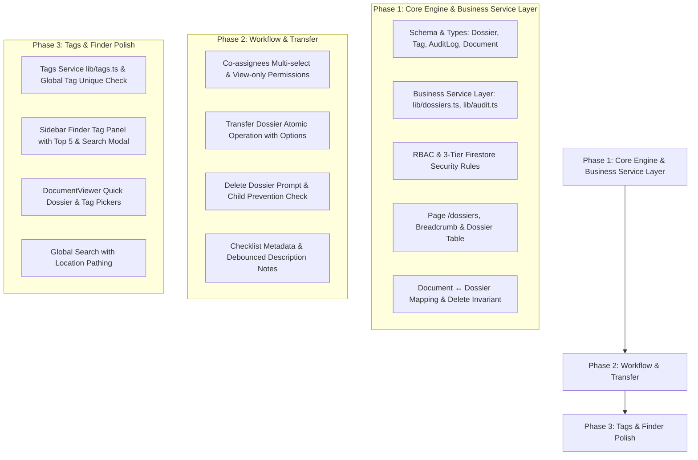

# Design Specification: Quản lý Hồ sơ, Người phối hợp & Hệ thống Tag Finder

**Ngày cập nhật:** 2026-08-24  
**Dự án:** `my-office` — Ứng dụng Quản lý Văn bản Hành chính  
**Trạng thái:** Đã tinh chỉnh kiến trúc chuẩn Production-Grade (Đã duyệt phản biện)  

---

## 1. Tổng quan & Mục tiêu

Tính năng mới mở rộng hệ thống `my-office` với 3 trụ cột chính:
1. **Trang Quản lý Hồ sơ (`/dossiers`):** Quản lý hồ sơ công việc theo dạng cây thư mục tối đa 3 cấp, giao diện Finder macOS, kèm Ghi chú mục đích và Checklist tiến độ hoàn thành. Hỗ trợ chuyển giao hồ sơ giữa các nhân viên.
2. **Người phối hợp (Co-assignees):** Bổ sung danh sách người phối hợp (nhiều người) song song với Người thực hiện chính (1 người). Người phối hợp có quyền xem văn bản nhưng không được hoàn thành hay chỉnh sửa ngày hoàn thành.
3. **Hệ thống Tag / Nhãn thông minh (macOS Finder style):** Gán tag màu cho Văn bản và Hồ sơ (`tagIds`); tích hợp bộ lọc Tag ở Sidebar bên trái với chế độ "5 nhãn phổ biến + Hiển thị tất cả + Tìm kiếm nhãn".
4. **Tích hợp Quick Picker:** Cho phép thêm/bớt Hồ sơ chứa và Tag ngay trong Modal xem văn bản (`DocumentViewer`).
5. **Nhật ký Hệ thống (Audit Log):** Ghi vết tất cả hành động thêm/sửa/xóa/chuyển giao hồ sơ và phân công văn bản qua Business Service Layer.

---

## 2. Phân quyền & Vai trò (RBAC 3 Tầng & Access Matrix)

### 2.1. Kiến trúc Bảo mật 3 Tầng
- **Tầng 1 (UI Permission):** Ẩn/hiện menu `/dossiers`, các nút thao tác trên giao diện.
- **Tầng 2 (Application Authorization):** Kiểm tra vai trò và điều kiện trong Business Service Layer trước khi gọi Firestore API.
- **Tầng 3 (Firestore Security Rules):** Chặn trực tiếp từ database server dựa trên `request.auth` và `resource.data`.

### 2.2. Ma trận Phân quyền Quyền Hạn (Access Matrix)

| Vai trò (Role) | Thư mục Hồ sơ (Dossier) | Văn bản (Document) |
|---|---|---|
| **Admin** | Full CRUD tất cả Hồ sơ toàn hệ thống | Full CRUD tất cả Văn bản |
| **Staff (Owner)** | Full CRUD Hồ sơ do mình sở hữu (`ownerId == staffId`) | Phụ thuộc phân công (Chính / Phối hợp) |
| **Staff (Assignee)** | Không mặc nhiên quản lý Hồ sơ chứa | Full workflow (Hoàn thành, sửa ngày) |
| **Staff (Co-assignee)** | Không mặc nhiên quản lý Hồ sơ chứa | Chỉ xem metadata, đính kèm, iframe (Read-only) |
| **Guest** | Không xem được (Ẩn menu `/dossiers`) | Chỉ xem theo quyền guest hiện tại |

Các công tắc cấu hình trong `/settings/permissions`:
- `canCreateDossier`: Cho phép tạo hồ sơ
- `canEditDossier`: Cho phép sửa tên/mô tả/checklist hồ sơ
- `canDeleteDossier`: Cho phép xóa hồ sơ
- `canTransferDossier`: Cho phép chuyển giao hồ sơ

---

## 3. Schema Dữ liệu Chuẩn hóa (Normalized Data Schema)

### 3.1. Collection `/dossiers/{dossierId}`
```typescript
export interface DossierChecklistItem {
  id: string              // nanoid (8 chars)
  title: string           // Tên công việc/hạng mục
  completed: boolean      // Trạng thái hoàn thành
  completedAt?: Timestamp // Thời điểm hoàn thành (tự động gán serverTimestamp)
  completedBy?: string    // staffId người tích hoàn thành
  order: number           // Thứ tự sắp xếp
}

export interface Dossier {
  id: string              // Firestore docId
  name: string            // Tên hồ sơ
  parentId: string | null // ID hồ sơ cha (null nếu Cấp 1)
  level: 1 | 2 | 3        // Cấp hồ sơ (Server tự tính toán dựa trên parent.level + 1)
  createdBy: string       // staffId người tạo ban đầu (Audit log)
  ownerId: string         // staffId người sở hữu/quản lý hiện tại (Source of Truth)
  description: string     // Ghi chú cấu trúc, mục đích hồ sơ
  checklist: DossierChecklistItem[] // Danh sách tiến độ
  tagIds: string[]        // Mảng ID các nhãn/tag (Tham chiếu `/tags`)
  deletedAt?: Timestamp   // Thời điểm xóa mềm (Soft delete)
  deletedBy?: string      // staffId người xóa
  createdAt: Timestamp
  updatedAt: Timestamp
}
```

### 3.2. Collection `/tags/{tagId}` (Dùng chung toàn hệ thống)
```typescript
export interface Tag {
  id: string              // Firestore docId
  name: string            // Tên nhãn (unique global, normalized lowercase check)
  color: string           // Mã màu (vd: #EF4444, #3B82F6...)
  createdBy: string       // staffId người tạo
  createdAt: Timestamp
}
```

### 3.3. Collection `/auditLogs/{logId}` (Nhật ký Hệ thống)
```typescript
export interface AuditLogMetadata {
  fromOwnerId?: string
  toOwnerId?: string
  transferredChildIds?: string[]
  reassignedDocumentIds?: string[]
  field?: string
  operation?: string
  [key: string]: any
}

export interface AuditLog {
  id: string              // Firestore docId
  entityType: 'dossier' | 'document' | 'tag'
  entityId: string
  action: 'CREATE' | 'UPDATE' | 'DELETE' | 'TRANSFER' | 'ASSIGN'
  actorId: string         // staffId người thực hiện
  metadata: AuditLogMetadata // Đã chuẩn hóa chi tiết
  createdAt: Timestamp
}
```

### 3.4. Cập nhật Document (`/documents/{docId}`)
```typescript
export interface Document {
  // ... các trường hiện tại giữ nguyên
  assigneeId?: string        // Người thực hiện chính (1 staffId)
  coAssigneeIds?: string[]   // Người phối hợp (mảng staffId)
  dossierIds?: string[]      // Mảng ID các hồ sơ chứa văn bản này
  tagIds?: string[]          // Mảng ID các nhãn/tag (Tham chiếu `/tags`)
}
```

---

## 4. Các Invariant Kỹ thuật & Logic Nghiệp vụ Chi tiết

### 4.1. Invariants Xóa Hồ sơ (Dossier Deletion Invariants)
1. **Ràng buộc Hồ sơ con (Child Invariant):** Không cho phép xóa trực tiếp Hồ sơ cha nếu vẫn còn Hồ sơ con bên trong. Hiển thị thông báo: *"Hồ sơ này đang có X hồ sơ con. Vui lòng di chuyển hoặc xóa các hồ sơ con trước khi xóa."*
2. **Ràng buộc Mảng `dossierIds` của Văn bản (Document Invariant):**
   - Khi xóa một Hồ sơ $D_2$, hệ thống **chỉ xóa duy nhất $D_2$** khỏi mảng `dossierIds` của văn bản (và thêm $D_{parent}$ nếu chọn Option A và chưa có $D_{parent}$).
   - **TUYỆT ĐỐI KHÔNG** đè hoặc làm mất các ID hồ sơ khác ($D_1, D_3$) mà văn bản đó đang thuộc về.
3. **Soft Delete:** Thực hiện gán `deletedAt` và `deletedBy`. Chỉ Admin có quyền xóa vĩnh viễn (Hard delete).

### 4.2. Invariants Chuyển giao Hồ sơ (Dossier Transfer Invariants)
1. **Ràng buộc Cây Hồ sơ con không được chọn (Deterministic Hierarchy Rule):**
   - Khi chuyển giao Hồ sơ $B$ sang Target User, bất kỳ Hồ sơ con $C$ nào **KHÔNG được chọn chuyển giao** sẽ được set `C.parentId = null` (trở thành Hồ sơ Cấp 1 độc lập thuộc sở hữu của Owner cũ).
   - Đảm bảo 100% **không xảy ra lỗi Cross-owner hierarchy** (Hồ sơ cha thuộc User B nhưng Hồ sơ con thuộc User A).
2. **Xử lý Trùng tên:** Tự động kiểm tra trùng tên theo bộ `(ownerId, parentId, normalizedName)`. Nếu trùng tên ở người nhận, tự động thêm suffix ` (Khôi chuyển)`.
3. **Phân công Văn bản:**
   - **Văn bản ĐÃ HOÀN THÀNH:** Giữ nguyên Người thực hiện chính (`assigneeId`) tại thời điểm hoàn thành.
   - **Văn bản CHƯA HOÀN THÀNH:** Bật tùy chọn `[x] Gán Người thực hiện chính sang người mới`. Nếu tích -> cập nhật `assigneeId = targetUser`.
4. **Server-side Atomic Operation:** Toàn bộ nghiệp vụ Transfer được xử lý tập trung tại Business Service (`lib/dossiers.ts`), chạy qua Firestore WriteBatch/Transaction để đảm bảo tính toàn vẹn (Atomic), không thực hiện các câu lệnh write lẻ tẻ ở Client.

### 4.3. Quy tắc Đặt tên & Cấp Hồ sơ (Level & Naming Rules)
- **Tính toán Cấp (Level):** Server/Service tự tính `level = parentId ? parent.level + 1 : 1`. Từ chối tạo nếu `level > 3`.
- **Độc nhất Tên Hồ sơ (Name Uniqueness):** Tên hồ sơ là duy nhất trong cùng một hồ sơ cha của cùng một Owner: `(ownerId, parentId, name.trim().toLowerCase())`.

### 4.4. Cấu trúc Business Service Layer
Các React UI Component tuyệt đối không gọi trực tiếp Firestore CRUD mà phải qua Business Service:
- `lib/dossiers.ts`: `createDossier()`, `updateDossier()`, `deleteDossier()`, `transferDossier()`, `addDocumentToDossier()`, `removeDocumentFromDossier()`.
- `lib/tags.ts`: `createTag()`, `updateTag()`, `deleteTag()`, `resolveTagIds()`.
- `lib/audit.ts`: `logAuditAction()`.

---

## 5. Lộ trình Triển khai (3 Phase Implementation Roadmap)



---

## 6. Kế hoạch Kiểm thử & Xác minh Comprehensive (Verification Plan)

1. **Kiểm thử Invariants Xóa Hồ sơ:**
   - Xóa Hồ sơ $D_2$ của Văn bản có `dossierIds = [D_1, D_2, D_3]` -> Xác minh mảng giữ nguyên `[D_1, D_3]`, không bị xóa sạch hoặc đè mảng.
   - Thử xóa Hồ sơ cha có 2 hồ sơ con -> Bị chặn với thông báo yêu cầu xóa/di chuyển hồ sơ con trước.
2. **Kiểm thử Deterministic Transfer & Hierarchy:**
   - Chuyển Hồ sơ $B$ sang User X (bỏ chọn Hồ sơ con $C$) -> Xác minh $C.parentId == null$, trở thành Cấp 1 của Owner cũ. Đảm bảo không xảy ra lỗi cross-owner.
3. **Kiểm thử Tag ID Resolution & Rename (Sửa Test đúng):**
   - Đổi tên Tag trong `/tags/{tagId}` -> Xác minh Văn bản và Hồ sơ **giữ nguyên `tagIds`**, UI tự động hiển thị tên nhãn mới qua Service `resolveTagIds()` mà không cần scan hay update Document.
4. **Kiểm thử Audit Log Phase 1:**
   - Thực hiện Tạo/Sửa/Xóa/Chuyển giao Hồ sơ -> Xác minh collection `/auditLogs` lưu chính xác `actorId`, `metadata` chuẩn hóa.
5. **Kiểm thử Security Rules Tầng 3:**
   - Dùng tài khoản Staff A gọi direct read query `/dossiers` của Staff B -> Firestore từ chối với lỗi `permission-denied`.
