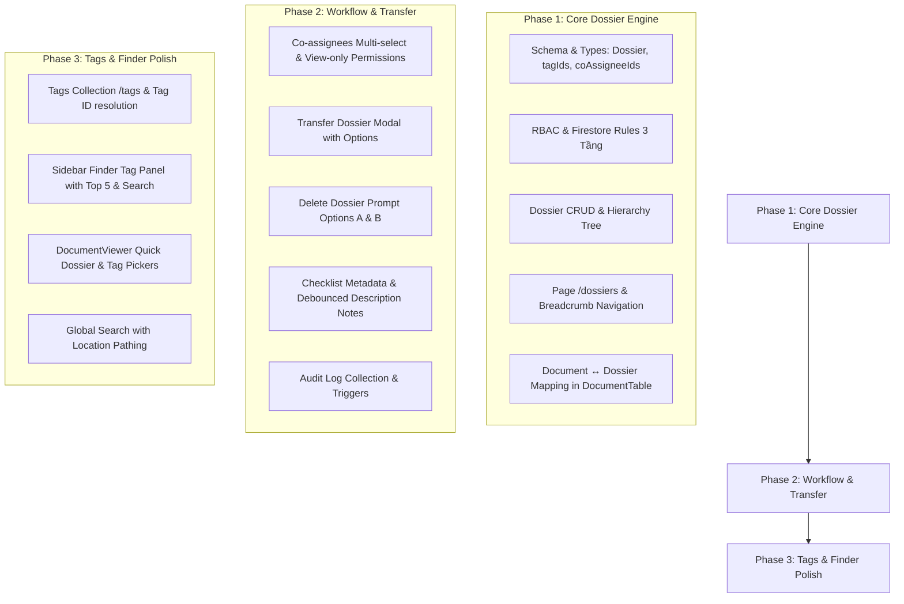

# Design Specification: Quản lý Hồ sơ, Người phối hợp & Hệ thống Tag Finder

**Ngày cập nhật:** 2026-08-24  
**Dự án:** `my-office` — Ứng dụng Quản lý Văn bản Hành chính  
**Trạng thái:** Đã cập nhật theo phản biện kiến trúc Production-Grade  

---

## 1. Tổng quan & Mục tiêu

Tính năng mới mở rộng hệ thống `my-office` với 3 trụ cột chính:
1. **Trang Quản lý Hồ sơ (`/dossiers`):** Quản lý hồ sơ công việc theo dạng cây thư mục tối đa 3 cấp, giao diện Finder macOS, kèm Ghi chú mục đích và Checklist tiến độ hoàn thành. Hỗ trợ chuyển giao hồ sơ giữa các nhân viên.
2. **Người phối hợp (Co-assignees):** Bổ sung danh sách người phối hợp (nhiều người) song song với Người thực hiện chính (1 người). Người phối hợp có quyền xem văn bản nhưng không được hoàn thành hay chỉnh sửa ngày hoàn thành.
3. **Hệ thống Tag / Nhãn thông minh (macOS Finder style):** Gán tag màu cho Văn bản và Hồ sơ (`tagIds`); tích hợp bộ lọc Tag ở Sidebar bên trái với chế độ "5 nhãn phổ biến + Hiển thị tất cả + Tìm kiếm nhãn".
4. **Tích hợp Quick Picker:** Cho phép thêm/bớt Hồ sơ chứa và Tag ngay trong Modal xem văn bản (`DocumentViewer`).
5. **Nhật ký Hệ thống (Audit Log):** Ghi vết tất cả hành động thêm/sửa/xóa/chuyển giao hồ sơ và phân công văn bản.

---

## 2. Phân quyền & Vai trò (RBAC 3 Tầng)

### 2.1. Kiến trúc Bảo mật 3 Tầng
- **Tầng 1 (UI Permission):** Ẩn/hiện menu `/dossiers`, các nút thao tác trên giao diện.
- **Tầng 2 (App Authorization):** Kiểm tra vai trò trong React Hooks (`usePermissions`, `useRole`) trước khi thực thi hàm API.
- **Tầng 3 (Firestore Security Rules):** Chặn trực tiếp từ database server nếu gọi API sai quyền.

### 2.2. Phân định Quyền Sở hữu Hồ sơ (`ownerId`) vs Người thực hiện Văn bản (`assigneeId`)
- `Dossier.ownerId`: Người sở hữu và quản lý Hồ sơ.
- `Document.assigneeId`: Người thực hiện chính văn bản.
- Chuyển giao Hồ sơ **không tự động thay đổi `assigneeId` của văn bản đã hoàn thành**.

### 2.3. Ma trận Phân quyền

| Chức năng | Admin | Staff (Nhân viên) | Guest |
|---|---|---|---|
| Menu "Quản lý Hồ sơ" ở Sidebar | Hiển thị | Hiển thị | Ẩn hoàn toàn |
| Xem Hồ sơ | Quản lý Hồ sơ do Admin sở hữu hoặc được chuyển | Quản lý Hồ sơ do Staff sở hữu (`ownerId == staffId`) | Không |
| Thêm / Sửa / Xóa Hồ sơ | Có | Phụ thuộc permission switch | Không |
| Chuyển giao Hồ sơ | Có | Phụ thuộc permission switch | Không |
| Hoàn thành văn bản | Tất cả văn bản | Chỉ văn bản làm Người chính (`assigneeId`) | Không |
| Xem văn bản làm Người phối hợp | Có | Có (`coAssigneeIds.includes(staffId)`) | Có |

Các công tắc cấu hình trong `/settings/permissions`:
- `canCreateDossier`: Cho phép tạo hồ sơ
- `canEditDossier`: Cho phép sửa tên/mô tả/checklist hồ sơ
- `canDeleteDossier`: Cho phép xóa hồ sơ
- `canTransferDossier`: Cho phép chuyển giao hồ sơ

---

## 3. Schema Dữ liệu Chuẩn hóa (Normalized Data Schema)

### 3.1. Collection `/dossiers/{dossierId}`
```typescript
export interface DossierChecklistItem {
  id: string              // nanoid (8 chars)
  title: string           // Tên công việc/hạng mục
  completed: boolean      // Trạng thái hoàn thành
  completedAt?: Timestamp // Thời điểm hoàn thành
  completedBy?: string    // staffId người tích hoàn thành
  order: number           // Thứ tự sắp xếp
}

export interface Dossier {
  id: string              // Firestore docId
  name: string            // Tên hồ sơ
  parentId: string | null // ID hồ sơ cha (null nếu Cấp 1)
  level: 1 | 2 | 3        // Cấp hồ sơ (1, 2, 3)
  createdBy: string       // staffId người tạo ban đầu (Audit log)
  ownerId: string         // staffId người sở hữu/quản lý hiện tại (Source of Truth)
  description: string     // Ghi chú cấu trúc, mục đích hồ sơ
  checklist: DossierChecklistItem[] // Danh sách tiến độ
  tagIds: string[]        // [CHUẨN HÓA] Mảng ID các nhãn/tag
  createdAt: Timestamp
  updatedAt: Timestamp
}
```

### 3.2. Collection `/tags/{tagId}`
```typescript
export interface Tag {
  id: string              // Firestore docId
  name: string            // Tên nhãn (unique string)
  color: string           // Mã màu (vd: #EF4444, #3B82F6...)
  createdBy: string       // staffId người tạo
  createdAt: Timestamp
}
```

### 3.3. Collection `/auditLogs/{logId}` (Nhật ký Hệ thống)
```typescript
export interface AuditLog {
  id: string              // Firestore docId
  entityType: 'dossier' | 'document'
  entityId: string
  action: 'CREATE' | 'UPDATE' | 'DELETE' | 'TRANSFER' | 'ASSIGN'
  actorId: string         // staffId người thực hiện
  metadata: Record<string, any> // Chi tiết thay đổi (ví dụ: fromUserId, toUserId...)
  createdAt: Timestamp
}
```

### 3.4. Cập nhật Document (`/documents/{docId}`)
```typescript
export interface Document {
  // ... các trường hiện tại giữ nguyên
  assigneeId?: string        // Người thực hiện chính (1 staffId)
  coAssigneeIds?: string[]   // Người phối hợp (mảng staffId)
  dossierIds?: string[]      // Mảng ID các hồ sơ chứa văn bản này
  tagIds?: string[]          // [CHUẨN HÓA] Mảng ID các nhãn/tag
}
```

---

## 4. Giao diện & Quy tắc Luồng Nghiệp vụ

### 4.1. Giao diện Trang `/dossiers`
- **Breadcrumb:** Đường dẫn thư mục `Hồ sơ của tôi / Kế hoạch / Chỉ đạo tuyến`.
- **Thanh Công cụ:** Nút `+ Thêm hồ sơ`, `Chuyển hồ sơ`, `Ghi chú & Tiến độ`, Ô tìm kiếm (`[ ] Tìm trong thư mục này` / `[x] Tìm toàn bộ`).
  - Khi tìm toàn bộ: Hiển thị thêm cột `📍 Vị trí lưu` (ví dụ: `Kế hoạch > Chỉ đạo tuyến`).
- **Tầng trên (Folders):** Thẻ thông tin các hồ sơ con (Tên, icon folder, số lượng văn bản, % tiến độ).
- **Tầng dưới (Document Table):** Tái sử dụng component `DocumentTable` đầy đủ chức năng (giao việc, xem/sửa/xóa, phân trang, filter status).
- **Panel bên phải (Collapsible):**
  - Textarea ghi chú mô tả mục đích hồ sơ (**tự động lưu dạng debounce 1000ms / onBlur** để tránh ghi Firestore liên tục).
  - Progress bar + danh sách Checklist có thông tin người tích và thời gian tích.

### 4.2. Logic Xóa Hồ sơ (Dossier Deletion Popup Prompt)
Khi người dùng bấm xóa một hồ sơ, hệ thống sẽ mở **Modal xác nhận chọn 1 trong 2 tùy chọn**:
- **Tùy chọn A:** *"Xóa hồ sơ và chuyển toàn bộ văn bản bên trong lên Hồ sơ cấp cha"* (Loại bỏ ID hồ sơ bị xóa, thêm ID hồ sơ cha vào `dossierIds`).
- **Tùy chọn B:** *"Xóa hồ sơ và giải phóng toàn bộ văn bản ra ngoài hồ sơ"* (Loại bỏ ID hồ sơ bị xóa khỏi `dossierIds`, văn bản trở thành văn bản tự do).

### 4.3. Logic Chuyển giao Hồ sơ (Dossier Transfer Logic)
Khi bấm "Chuyển hồ sơ", hiển thị Modal gồm:
1. Dropdown chọn **Người nhận mới (Target User)**.
2. Danh sách Checkbox cây hồ sơ con (Cấp 2, 3) thuộc Hồ sơ đang chọn (Mặc định tích chọn tất cả).
3. **Quy tắc phân công Văn bản:**
   - **Văn bản ĐÃ HOÀN THÀNH:** Giữ nguyên Người thực hiện chính (`assigneeId`) tại thời điểm hoàn thành. **Không gán người chính mới**.
   - **Văn bản CHƯA HOÀN THÀNH:** Hiển thị công tắc tùy chọn `[x] Gán Người thực hiện chính của văn bản chưa hoàn thành sang người mới`. Nếu tích chọn -> Cập nhật `assigneeId = targetUser`. Nếu bỏ chọn -> Giữ nguyên `assigneeId` cũ.
4. **Xử lý trùng tên:** Nếu bên người nhận đã có hồ sơ cùng tên, tự động nối đuôi tên dạng `Kế hoạch (Khôi chuyển)`.
5. **Xử lý Hồ sơ con KHÔNG được tích chọn:** Set `parentId = null` (trở thành Hồ sơ Cấp 1 tự do) hoặc gán về Cấp cha thuộc sở hữu của User hiện tại để tránh lỗi "Cross-owner hierarchy".

### 4.4. Người phối hợp (Co-assignees)
- Multi-select dropdown chọn người phối hợp `coAssigneeIds` trong `DocumentModal`.
- Người thực hiện chính tự động bị loại khỏi danh sách chọn Người phối hợp.
- Người phối hợp chỉ có quyền xem văn bản. Nút Hoàn thành và ô chỉnh ngày hoàn thành bị vô hiệu hóa kèm tooltip thông báo.

### 4.5. Panel Tag Sidebar Finder & Quick Picker Viewer
- Sidebar bên trái hiển thị mục `NHÃN (TAGS)` liệt kê 5 tag phổ biến nhất + nút `Hiển thị tất cả` (mở Modal danh sách đầy đủ kèm ô Tìm kiếm tag).
- Lọc theo Tag ID (`tagIds`).
- Trong `DocumentViewer`: Cột trái hiển thị mục `Hồ sơ chứa` và `Nhãn (Tags)` cho phép thêm/bớt nhanh trực tiếp.

---

## 5. Lộ trình Triển khai (3 Phase Implementation Roadmap)



---

## 6. Kế hoạch Kiểm thử & Xác minh Comprehensive (Verification Plan)

1. **Kiểm thử Bảo mật (Security Rules & RBAC):**
   - Đăng nhập Guest -> Gọi direct Firestore query `/dossiers` -> Phải nhận `permission-denied`.
   - Đăng nhập Staff A -> Truy vấn `/dossiers` của Staff B -> Phải nhận `permission-denied` từ Firestore Rules.
2. **Kiểm thử Xóa Hồ sơ (Prompt Options):**
   - Chọn Option A -> Xác minh văn bản được đẩy lên hồ sơ cha.
   - Chọn Option B -> Xác minh văn bản thành văn bản tự do.
3. **Kiểm thử Chuyển giao Hồ sơ:**
   - Chuyển hồ sơ có văn bản hoàn thành & chưa hoàn thành -> Xác minh văn bản hoàn thành giữ nguyên `assigneeId`, văn bản chưa hoàn thành gán đúng theo tùy chọn user.
4. **Kiểm thử Tag ID & Rename:**
   - Tạo tag -> Gán `tagId` -> Đổi tên tag -> Xác minh tất cả văn bản & hồ sơ cập nhật tên nhãn tức thì không cần scan database.
5. **Kiểm thử Audit Log:**
   - Tạo/Sửa/Xóa/Chuyển hồ sơ -> Kiểm tra collection `/auditLogs` lưu đầy đủ `actorId`, `action`, `metadata`.
